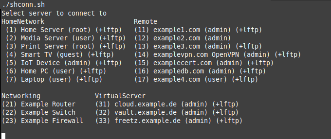
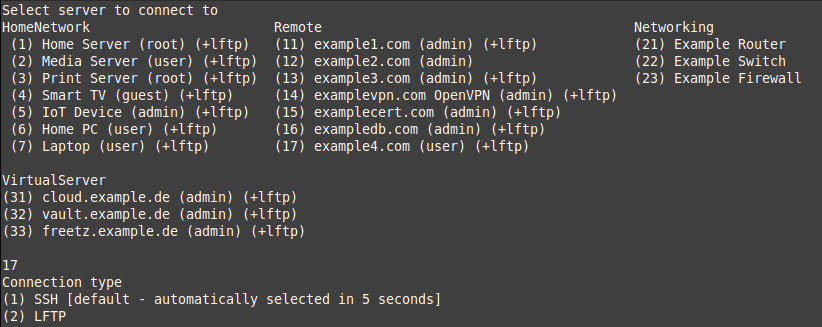
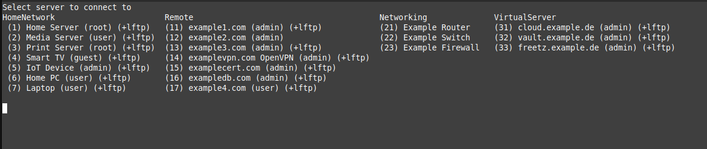

# SHConn - A BASH Server Connection Manager

## Description
This Bash script facilitates connecting to multiple servers by providing a user-friendly menu interface. It reads server configurations from a YAML file and organizes them into tables for easy selection. Users can connect to their desired server via SSH or LFTP, with options for automatic selection based on server availability as defined in the YAML file.

## Features
- Configurable number of columns for output tables.
- Debugging output for troubleshooting.
- Automatic determination of the number of columns based on terminal width.
- Support for SSH and LFTP connections.

## Images
### Example Output - 2 Columns

### Example Output - 3 Columns

### Example Output - 4 Columns

## Requirements
- Bash shell
- `ssh` and `lftp` commands available on the system (if you don't use lftp, you don't need it installed)
- YAML configuration file (`.shconfig.yml`) containing server details

## Installation
- Download and unzip or clone this repo
- Execute the included `install.sh` script that will copy shconn.sh to /bin (sudo or root account required)
- Alternatively:
- Copy the shconn.sh to a directory in  your `$PATH` and `.shconfig.yml.dist` into you home directory and rename it to `.shconfig.yml`

## Usage
1. Modify the configuration file located at `~/.shconfig.yml` or `/etc/.shconfig.yml` to define server details.
2. Execute the script to display a list of servers.
3. Select the desired server by entering the corresponding number.
4. Choose the connection type (SSH or LFTP) if prompted.

## Configuration Variables
- `NUM_COLS`: Number of columns to display in the server list.
- `AUTO_COLS`: Automatically calculate the number of columns based on terminal width.
- `DEBUGOUT`: Enable or disable debug messages.
- `GSTEP`: Server index group offset.
- `INPWAIT`: Timeout for automatic connection type selection.
`GSTEP`: By default set to 10. If you plan to have more than 10 server in a single group increase this number accordingly

## Included Script
This script includes a YAML parsing function sourced from [parse_yaml](https://github.com/mrbaseman/parse_yaml.git). This external script is also licensed under the GPL3.

## License
This script is licensed under the GNU General Public License v3.0 (GPL3). See [GNU GPLv3](http://www.gnu.org/licenses/) for details.
